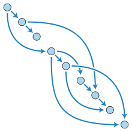

<h1 align="center"> dlist </h1>  

    

  Resolve and list all of the runtime required dependencies for a give CPAN perl distribution. Built with Go.

    

## Table of Contents

- [Author](#author)
- [About](#about)
- [Installation](#installation)
- [Usage](#usage)
- [UnitTest](#unittest)
- [Deficiencies](#deficiencies)

## Author
Barry T. Burch 

Barry is a digital native with over 20 years of experience in software (and hardware) design and engineering at:

    
    
    
    
    
    

barry@sbcglobal.net 
www.linkedin.com/in/barry-burch-digital-native 

## About

dlist was created to be submitted to ActiveState as the coding exercise portion of the interview process
 for a position as a software engineer.

## Installation

dlist is written in Go. To run it (on macOS or Linux) you will need to:

    1. Install Go 1.12 or later on your system.

    2. Un-tar the submitted dlist tarball (dlist.tar.gz) into a <working dir> on your system ('tar xfvz dlist.tar.gz').

    3. Change directory to <working dir>/dlist

    3. Edit <working dir>/dlist/.env and update the path to the dlist/data directory.

    4. Edit <working dir>/dlist/internal/app/dlist/.env and update the path to the dlist/data directory.

    5. Change directory to <working dir>/dlist and build the dlist executable with 'go build' .

    6. You should now have the runnable dlist executable named 'dlist' in <working dir>/dlist .

## Usage

Note: I chose to use the 3rd party cobra CLI package to implement the UI for dlist. Due to how cobra works,
dlist deviates from the ActiveState requirements in that specifying '--name' multiple time will not work.

    1. Complete the Installation section of this document.

    2. Change directory to <working dir>/dlist 

    3. See usage for dlist: 'dlist' or 'dlist --help' 

    4. To run dlist for 1 CPAN perl distro name: 'dlist listDeps --name <distro name>' ( e.g.
     'dlist listDeps --name Class-Load' ).

    5. To run dlist for multiple CPAN perl distro names: 'dlist listDeps --name <distro name>,<distro name>,...<distro name>'
     (e.g. 'dlist listDeps --name Class-Load,B-Hooks-EndOfScope' ).

## UnitTest

    1. Complete the Installation section of this document.

    2. Change directory to <working dir>/dlist/internal/app/dlist

    3. Run the unit test(s) with 'go test -v'

## Deficiencies

    1. The dlist UI does not meet the ActiveState UI requirements (see the Usage section for details).

    2. When dlist is run specifying multiple distro names, the output is valid JSON but the whitespace alignment
     of the top-level objects does not look right.

    3. The dlist output does not meet the ActiveState requirements:

        a. The specified distro names are included as top-level objects in the JSON output.

        b. When the specified distro names have no dependencies, instead of an empty JSON block, the distro 
         names are inserted into the JSON as top-level objects with empty values.

